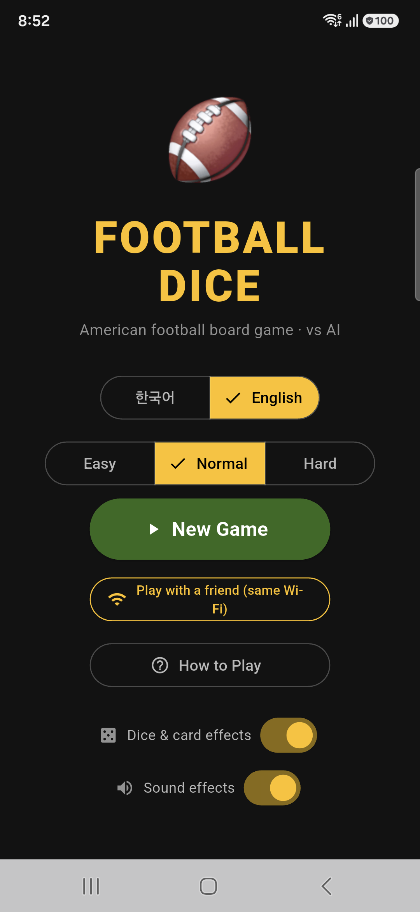
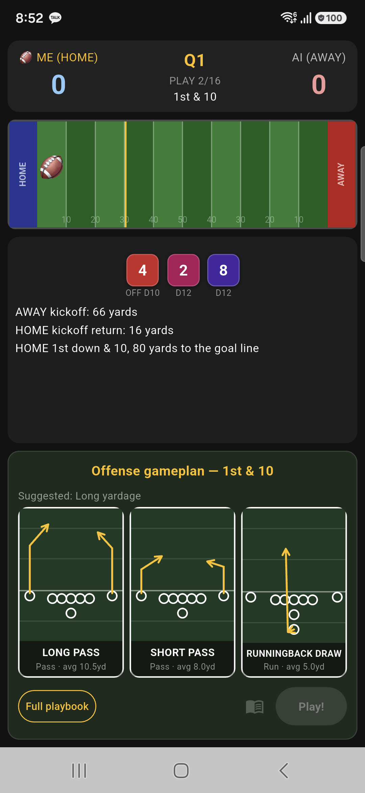
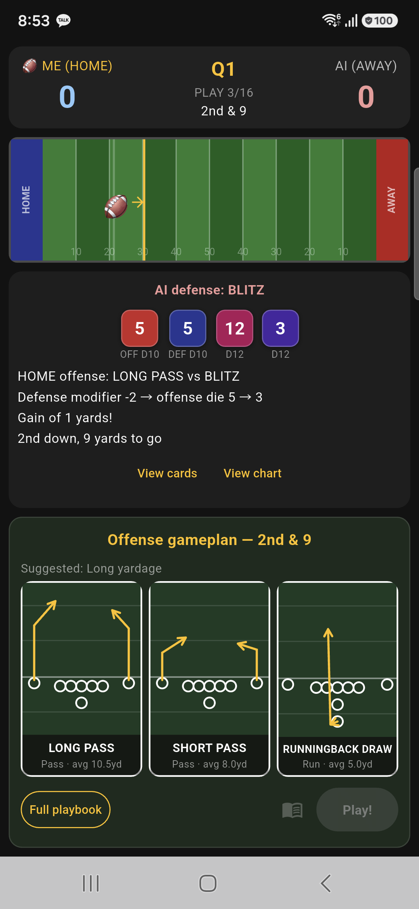

# Football Dice 🏈

American football board game · vs AI — a dice-and-card football strategy game built with Flutter.

Pick a play from your offense/defense playbook, roll the dice, and see the outcome resolved against a matchup chart — just like a tabletop football board game. Play against the AI, or challenge a friend on the same Wi-Fi network.

## Screenshots

| Home | Offense gameplan | Play result |
| --- | --- | --- |
|  |  |  |

## Features

- **Dice + card matchup engine** — offense/defense cards resolve against a dice chart, with modifiers for blitzes, coverage, and formations
- **AI opponent** with selectable difficulty (Easy / Normal / Hard)
- **Local multiplayer** — host or join a game with a friend over the same Wi-Fi network
- **Full playbook** — browse every offense and defense card, not just the suggested plays
- **Korean / English** localization
- **Dice & card animations** and sound effects, both toggleable in settings

## Getting Started

This is a Flutter project targeting Android, iOS, and Web.

```bash
flutter pub get
flutter run
```

### Regenerating app icons / splash screen

App icon and native splash screen assets are generated from `assets/icon/`:

```bash
dart run flutter_launcher_icons
dart run flutter_native_splash:create
```

A few resources to get you started if this is your first Flutter project:

- [Learn Flutter](https://docs.flutter.dev/get-started/learn-flutter)
- [Write your first Flutter app](https://docs.flutter.dev/get-started/codelab)
- [Flutter learning resources](https://docs.flutter.dev/reference/learning-resources)
